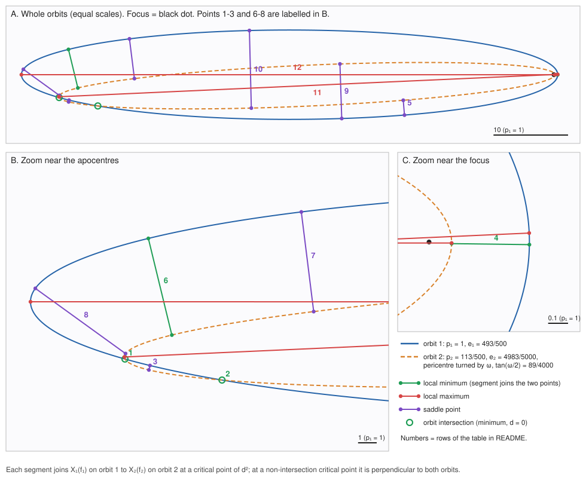
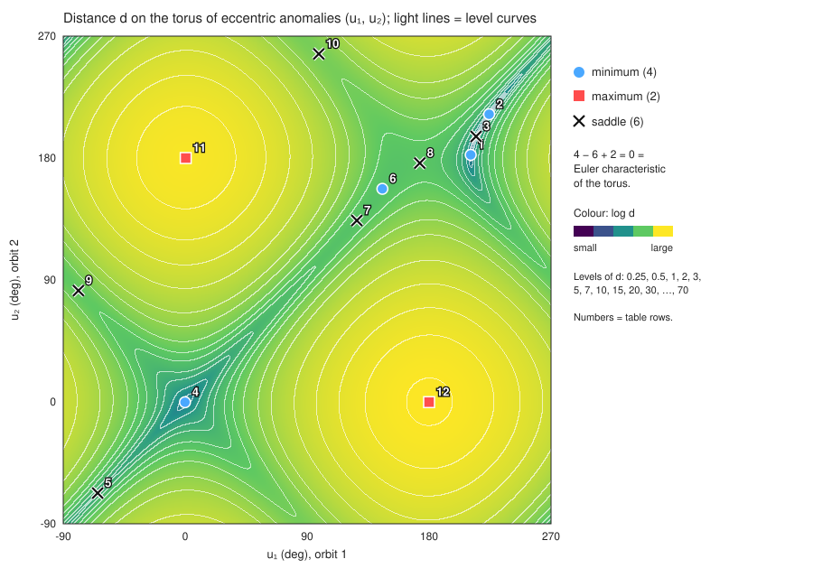

# 同じ平面のケプラー軌道 2 本は、距離の臨界点を 12 個持てる（Gronchi–Baù–Grassi 2023）

*日本語が先、英語は後半にあります。/ Japanese first; the English version follows below.*

## 問題（Problem）

同じ平面にあり、焦点を共有する 2 つの楕円を考える。物理的には、同じ太陽の周りを同じ平面で回る 2 つの天体の軌道にあたる。
それぞれの楕円上に 1 点ずつ取り、その距離を `d` とする。2 点を軌道に沿って別々に動かすと、`d²` は 2 つの角度のなめらかな関数になる。

**この関数の臨界点は最大でいくつあるか？**

Gronchi・Baù・Grassi（2023）は「高々 12 個」を証明したうえで、本当の最大は 10 個だと予想した。

## 出典（Source）

* G. F. Gronchi, G. Baù, C. Grassi, *Revisiting the computation of the critical points of the
  Keplerian distance*, Celest. Mech. Dyn. Astron. **135**:48 (2023)。
  DOI [10.1007/s10569-023-10161-4](https://doi.org/10.1007/s10569-023-10161-4)、
  arXiv: <https://arxiv.org/abs/2305.13900>（PDF: <https://arxiv.org/pdf/2305.13900>）。
* §7「The planar case」は arXiv 版 PDF の 17〜20 ページにある。予想は **20 ページ目**:

  > "Therefore, we can not have more than 10 critical points which do not correspond to trajectory
  > intersections. Then, the maximum number of critical points of d² (including intersections) for
  > two elliptic orbits in the planar case is at most 12. However, we remark that this bound has never
  > been reached in our numerical tests, where we got at most 10 critical points that we think is the
  > maximum number. This conjecture adds a new question to Problem 8 in [1]."

  （訳: したがって、軌道の交点に当たらない臨界点は 10 個を超えない。よって平面の場合、2 つの楕円軌道の d² の臨界点（交点を含む）は高々 12 個である。ただし、この上界は我々の数値実験では一度も達成されず、最大は 10 個だった。我々は 10 が最大だと考える。この予想は [1] の問題 8 に新しい問いを加える。）

  [1] は A. Albouy, H. E. Cabral, A. A. Santos, *Some problems on the classical n-body problem*,
  Celest. Mech. Dyn. Astron. 113 (2012) 369–375（arXiv:1305.3191）。

**論文の記法（本文で確認済み）。** 軌道 *i* の通径（パラメータ）を `pᵢ = aᵢ(1−eᵢ²)`、離心率を `eᵢ`、真近点角を `fᵢ` とする。
軌道 1 の近点は x 軸方向にあり（`ω₁ = 0`）、軌道 2 の近点はそこから角度 `ω₂` だけ回っている。以下ではこれを `ω` と書く。

```
X₁ = r₁ (cos f₁, sin f₁),            r₁ = p₁ / (1 + e₁ cos f₁)
X₂ = r₂ (cos(f₂+ω), sin(f₂+ω)),      r₂ = p₂ / (1 + e₂ cos f₂)
```

§7 は、交点でない臨界点について次の (38)(39) を導く。

```
(38)  α cos f₂ + β sin f₂ + α e₂ = 0
(39)  μ cos f₂ + δ = 0
α = sin(ω − f₁) + e₁ sin ω,     β = cos(ω − f₁) + e₁ cos ω,     μ = p₁ e₁ e₂ sin f₁,
δ = p₁ e₁ sin f₁ + p₂ e₂ (1 + e₁ cos f₁)(cos f₁ sin ω − sin f₁ cos ω + e₁ sin ω)
```

`f₂` を消去すると、`f₁` の 5 次の三角多項式 (41) が得られる。

```
(41)  (α² + β²) δ² − 2 e₂ α² δ μ + μ² (e₂² α² − β²) = 0
```

## 答え（Answer）

**予想は成り立たない。臨界点は 12 個になりうる。したがって平面の場合の最大はちょうど 12 である。**

例（数値はすべて厳密な有理数）:

| | 通径 p | 離心率 e | 近点の向き | 近日点距離 q = p/(1+e) | 軌道長半径 a |
|---|---|---|---|---|---|
| 軌道 1 | 1 | 493/500 = 0.986 | 0 | 500/993 ≈ 0.50352 | 250000/6951 ≈ 35.966 |
| 軌道 2 | 113/500 = 0.226 | 4983/5000 = 0.9966 | tan(ω/2) = 89/4000 となる ω（ω ≈ 2.54924°） | 1130/9983 ≈ 0.11319 | 5650000/169711 ≈ 33.292 |

この例で `d²` の臨界点は **ちょうど 12 個** ある。

* 軌道の交点が 2 個（`d = 0`、どちらも極小）
* それ以外が 10 個（極小 2、極大 2、鞍点 6）

全体では極小 4・極大 2・鞍点 6 で、4 − 6 + 2 = 0 はトーラスのオイラー標数と合う。
論文の 10 個の例（Table 2）は交点 2 個を含むので、交点でない臨界点は 8 個である。この例は、論文が別に示した「交点でない臨界点は 10 個まで」という上界にも達している。

| # | 種類 | 交点か | f₁（度） | f₂（度） | u₁（度） | u₂（度） | d |
|---|---|---|---|---|---|---|---|
| 1 | 極小 | はい | -177.3550671 | -179.9043087 | 210.7479203 | 182.3185657 | 0 |
| 2 | 極小 | はい | -176.0791223 | -178.6283639 | 224.3600686 | 212.3524426 | 0 |
| 3 | 鞍点 | いいえ | -176.9957262 | -179.3380391 | 214.6901736 | 195.9378639 | 0.2456321306 |
| 4 | 極小 | いいえ | -1.493623671 | -6.591399612 | 359.8745877 | 359.7276985 | 0.3901875046 |
| 5 | 鞍点 | いいえ | -164.877342 | -172.9075872 | 295.37248 | 292.6821105 | 1.991839745 |
| 6 | 極小 | いいえ | 177.0176741 | 179.0483491 | 145.5483171 | 157.2421732 | 5.324456206 |
| 7 | 鞍点 | いいえ | 175.1701416 | 177.9855643 | 126.6590866 | 133.8479943 | 5.377161697 |
| 8 | 鞍点 | いいえ | 179.4217667 | 179.8455739 | 173.1212374 | 176.2591298 | 5.958788711 |
| 9 | 鞍点 | いいえ | -168.3223434 | 174.5751661 | 281.2252745 | 82.11399649 | 7.328247738 |
| 10 | 鞍点 | いいえ | 171.741224 | -176.2493429 | 98.61636322 | 256.8600182 | 10.4136729 |
| 11 | 極大 | いいえ | 5.10106314 | -179.9999344 | 0.4285683242 | 180.0015886 | 66.97460844 |
| 12 | 極大 | いいえ | 179.9999426 | -5.097989048 | 179.9993169 | 359.789487 | 71.54187578 |

`f` は真近点角、`u` は離心近点角（論文の Table 3 は `u` を使う）。距離の単位は `p₁`。各点は幅 1e-40 未満の箱で厳密に囲んである（`verify/` を参照）。表の数字は丸めた値。





## なぜ（Why、初学者向け）

**2 本の軌道の間の距離。** 軌道 1 上の点は角度 `f₁` で、軌道 2 上の点は角度 `f₂` で決まる。どちらの角度も 360° で一周するので、組 `(f₁, f₂)` は *トーラス*（ドーナツの表面）の上を動く。
距離の 2 乗 `d²(f₁, f₂)` は、このトーラスの上の「地形」と考えられる。

**臨界点。** 地形が平らになっている場所のこと。どちらの点を少し動かしても、距離は 1 次の近似では変わらない。次の 3 種類がある。

* **極小**: 2 点がその近くで一番近い（谷底）
* **極大**: その近くで一番遠い（山頂）
* **鞍点**: ある向きには近づき、別の向きには遠ざかる（峠）

幾何的には、交点でない臨界点では、2 点を結ぶ線分が *両方の* 軌道に垂直になる（1 枚目の図の線分）。とくに、そこでは 2 本の軌道の接線が平行になる。

**天文学で大事な理由: MOID。** MOID（Minimum Orbit Intersection Distance、最小軌道交差距離）は 2 本の軌道の間の最短距離で、`d` の最小値にあたる。衝突の危険度を見積もるときの最初のふるいとして使われる。
たとえば、地球との MOID が 0.05 au 未満で、ある程度大きい小惑星は「潜在的に危険な小惑星」に数えられる。
Gronchi の方法は、`d²` の臨界点を *すべて* 多項式の根として求めて MOID を計算する。臨界点の最大個数が分かれば、接近の候補（極小）が最大でいくつありうるか、多項式の次数をどこまで下げられるかが分かる。

**数の検算。** トーラス上の関数で、臨界点がすべて非退化なら、（極小の数）−（鞍点の数）+（極大の数）= 0 になる。ここでは 4 − 6 + 2 = 0。

**なぜ今まで見つからなかったか。** 2 つの楕円はどちらも極端に細長く（e ≈ 0.986 と 0.9966）、向きもほぼそろっている（ω ≈ 2.5°）。図の拡大で分かるとおり、臨界点の多くは遠い側の端（遠点）の近くに固まっている。
この例を見つけた調査では、無作為な配置を 145 万個調べても 12 個の例は 1 つも出なかった。離心率の大きい方向へ山登り探索をして、初めて見つかった。論文の数値実験が 10 個で止まったのはこのためと考えられる。

## 証明（Proof）

**手順 1（臨界点とは何か）。** `τᵢ = ∂Xᵢ/∂fᵢ` とおくと、次が成り立つ。

```
∂d²/∂f₁ = 2⟨X₁ − X₂, τ₁⟩,   ∂d²/∂f₂ = −2⟨X₁ − X₂, τ₂⟩,
τ₁ = p₁/(1+e₁cos f₁)² · (−sin f₁, cos f₁ + e₁),
τ₂ = p₂/(1+e₂cos f₂)² · (−sin(f₂+ω) − e₂ sin ω, cos(f₂+ω) + e₂ cos ω).
```

`X₁ ≠ X₂` のとき、平面では「`X₁ − X₂ ⟂ τ₁` かつ `X₁ − X₂ ⟂ τ₂`」は「`X₁ − X₂ ⟂ τ₁` かつ `τ₁ ∥ τ₂`」と同じである。これが論文の (35)(36) で、(38)(39) と同値になる。

**手順 2（1 変数への帰着）。** `μβ ≠ 0` となる `f₁` を固定すると、(38)(39) は `(cos f₂, sin f₂)` について *1 次式* になる。解はただ 1 つで、

```
cos f₂ = −δ/μ,     sin f₂ = −α (cos f₂ + e₂)/β
```

この解が単位円の上にあるのは、(41) が成り立つときに限る。`t = tan(f₁/2)` とおくと `cos f₁ = (1−t²)/(1+t²)`、`sin f₁ = 2t/(1+t²)` で、(41)·(1+t²)⁵ は有理係数の 10 次多項式 `F(t)` になる。

**手順 3（12 個の臨界点が存在すること。Lean 4 で検証済み）。**
ファイル [`KeplerianDistance.lean`](KeplerianDistance.lean) の定理 `twelve_critical_points` の主張:

```lean
∃ P : Fin 12 → ℝ × ℝ,
  (∀ i, HasFDerivAt sqDist (0 : ℝ × ℝ →L[ℝ] ℝ) (P i)) ∧                          -- すべて臨界点
  (∀ i j : Fin 12, ∀ m n : ℤ,
      P i = ((P j).1 + 2 * π * m, (P j).2 + 2 * π * n) → i = j) ∧              -- トーラス上で相異なる
  (∀ i, sqDist (P i) = 0 ↔ (i = 0 ∨ i = 2))                                     -- 交点はちょうど 2 個
```

言葉で言うと次の 3 つ。

* 12 個の点 `P i` すべてで、`d²` の（フレシェ）微分がちょうど 0 になる。
* 12 個はトーラス上で互いに異なる（2π の整数倍のずれも同一視したうえで）。
* `d² = 0` となるのは `P 0` と `P 2` だけ（交点がちょうど 2 個）。

`sqDist (f₁, f₂) = |X₁(f₁) − X₂(f₂)|²` は、`Real.cos`・`Real.sin`・真近点角と `ω = 2 arctan(89/4000)` で定義してある。証明の流れは次のとおり。

1. *交点でない 10 点。* `F` は次の有理数の区間のそれぞれで符号が変わる。
   `[−38.2, −38.1]`, `[−9.78, −9.77]`, `[−7.54, −7.53]`, `[−0.0131, −0.013]`, `[0.0445, 0.0446]`,
   `[13.8, 13.9]`, `[23.7, 23.8]`, `[38.4, 38.5]`, `[198, 199]`, `[1990000, 2000000]`。
   符号は `norm_num` で厳密に評価し、中間値の定理で根 `t` を得る。
   これらの区間では `t ≠ 0`（つまり `μ ≠ 0`）かつ `β ≠ 0` である（`β` は `t` の 2 次式で、`nlinarith` で確かめる）。
   `f₁ = 2 arctan t` とし、`f₂` を手順 2 の式で与えられる `cos f₂ + i sin f₂` の偏角とする。`F(t) = 0` だから、この点は単位円の上にある。
   あとは厳密な式変形（`field_simp`, `ring`, `linear_combination`）で、2 つの偏微分がどちらも 0 になることを示す。
2. *交点 2 点。* `X₁(f₁) = X₂(f₁ − ω)` は `p₁(1 + e₂ cos(f₁−ω)) = p₂(1 + e₁ cos f₁)` と同値で、これは 2 次式 `Iq(t) = 0` になる。
   `Iq` は `[−43.4, −43.3]` と `[−29.3, −29.2]` で符号が変わる。そこでは `d² = 0` なので、勾配も 0 になる。
3. *相異なること。* 12 個の `t` は互いに交わらない区間にあり、`f₁ = 2 arctan t` は `(−π, π)` に入る。したがって第 1 座標は 2π の差を除いても異なる。
4. *10 点は交点でない。* `(2 arctan t, f₂)` で `d² = 0` なら、2 点の半径と偏角が一致し、そこから `Iq(t) = 0` が出る。しかし 10 個の区間では `Iq ≠ 0` である。

ファイルに `sorry`・`admit`・`native_decide`・`axiom` は無い。`#print axioms` の出力は `propext, Classical.choice, Quot.sound` だけである。

**手順 4（ちょうど 12 個であることと、その種類。計算機援用・厳密計算・独立な 2 本のプログラム）。**

* [`verify/sturm_count.py`](verify/sturm_count.py) は Python の整数と `Fraction` だけを使い、次を示す。
  * `F` の Sturm 列から **実根はちょうど 10 個**。`F` は無平方。
  * `gcd(F, t) = gcd(F, β·(1+t²)) = 1`。
  * `μ = 0`（`f₁ ∈ {0, π}`。そこでは `δ ≠ 0`）の場合と `β = 0` の場合（そこでは `F = α²(δ − e₂μ)²` なので gcd で除外できる）からは、余分な点は出ない。
  * 交点の 2 次式の実根はちょうど 2 個で、`f₁ = π` は交点でない。
  * `gcd(F, Iq) = 1`。

  よって臨界点はちょうど 10 + 2 = 12 個。
* [`verify/krawczyk_torus.py`](verify/krawczyk_torus.py) は、`F` も論文の帰着もいっさい使わない。
  * 半角の座標（4 枚のチャートでトーラスを覆う）で、`d²(t, s)` を sympy で厳密に微分する。
  * 2 進有理数の区間演算と Krawczyk 判定で、分枝限定（branch-and-prune）を回す。
  * すべての箱は「零点なし」と判定されるか、「零点がちょうど 1 個ある」と認証されるかのどちらかになる。

  結果は **トーラス全体で臨界点ちょうど 12 個**。区間で評価したヘッセ行列の符号から **極小 4・極大 2・鞍点 6** で、すべて非退化。
* 2 本のプログラムの結果は、互いにも、Lean の区間とも、40 桁の数値計算とも一致する。

**頑健さ。** 12 個の臨界点はすべて非退化で、2 つの交点では軌道が横断的に交わる。陰関数定理により、この配置に十分近い配置もすべて 12 個の臨界点を持つ。つまりこの例はたまたまの 1 点ではなく、12 個はパラメータの開集合で実現する。

**上界（論文の議論の要約）。**
* 交点でない臨界点は、(38)–(39) の解に対応する。
* `μβ ≠ 0` なら、5 次の三角多項式 (41) の根 `f₁` 1 つにつき臨界点がちょうど 1 つ対応する。このような多項式の根は円周上に高々 10 個なので、交点でない臨界点は高々 10 個。
* 交点は `A cos f₁ + B sin f₁ = C` を満たし、その解は高々 2 個。
* 合わせて、`d²` の臨界点は高々 12 個。

論文は次数の数え上げを「一般には（in general）」と書いている。退化した場合についての当方の読みは次のとおり。
* 根で `β = 0` または `μ = 0` となるなら、(41) はそこで重複度 2 以上の根を持つ。
* その根からは高々 2 点しか出ない（直線と円の交点は高々 2 個）。

したがって、(41) が恒等的に 0 でない限り、上界 12 は成り立つ。この補足は当方のもので、12 個が実現するという証明はこれに依存しない。

## 検証（Verification）

実行コマンド・出力・所要時間は [`VERIFY.md`](VERIFY.md) にまとめた。要点:

```sh
# Lean 4（v4.33.1、Mathlib v4.33.1）。Mathlib の入った Lake プロジェクトから実行する。例:
# from the repository root (after `lake exe cache get`)
lake env lean -DautoImplicit=false -DrelaxedAutoImplicit=false \
  space/keplerian-distance/KeplerianDistance.lean
#   -> 'OpenQuestions.KeplerianDistance.twelve_critical_points' depends on axioms: [propext, Classical.choice, Quot.sound]

cd space/keplerian-distance/verify
python3 sturm_count.py      # 厳密計算: 実根 10 個 + 交点 2 個 = 12               （1 秒未満）
python3 krawczyk_torus.py   # 独立な検証: トーラス上で認証済みの零点 12 個、4/2/6  （約 5 秒、sympy が必要）
python3 make_figures.py     # 表と orbits.svg・torus.svg                         （numpy・mpmath が必要）
```

Lean は約 45 秒で通る。

## 現状（Status）

* **解決（予想は偽）。** 相異なる臨界点 12 個（交点 2・それ以外 10）の存在は **Lean 4 で検証済み**。
  ちょうど 12 個であることと種類は、**厳密な有理数計算による計算機援用の証明**（独立な 2 本のプログラムで一致）。論文の上界と合わせて、平面の場合の最大はちょうど 12。
* **既出の確認（2026-10-04）。** 平面で 11 個または 12 個の例を示した先行文献は見つからなかった。
  * 論文の被引用は、Semantic Scholar・OpenAlex・Google Scholar のどれでも 3 件（Hu ほか PSJ 2025、Rivero ほか CNSNS 2025、Scantamburlo–Gronchi–Baù CMDA 2024）。どれも平面の臨界点の数は扱っていない。
  * Gronchi の業績一覧と CV（2025-12 更新）にも、2023 年以降の続報は無い。
  * Gronchi の 2020 年の講義スライド（Bad Hofgastein、9 枚目。Gronchi, CMDA 93 (2005) の Table II にも同じ例がある）の「臨界点 12 個の例」は **相互傾斜 80° の空間配置** で、平面ではない。
  * Clara Grassi の博士論文（ピサ、2024）はアクセスが遮断されていて読めなかった。2023 年の論文の内容を繰り返している可能性が高いが、確認はできていない。
* **未解決のまま:** 空間の場合の ACS 問題 8 そのもの。
  * 空間の共焦点 2 楕円で 12 が最大か（知られている上界は 16）。
  * 片方が円なら 10 が最大か。

  平面の例は空間の特別な場合で、臨界点は 12 個だから、空間で予想されている最大値 12 と矛盾しない（反例ではない）。円と楕円の場合については何も言わない。

## ファイル（Files）

| ファイル | 内容 |
|---|---|
| `KeplerianDistance.lean` | Lean 4 の証明（名前空間 `OpenQuestions.KeplerianDistance`）、定理 `twelve_critical_points` |
| `verify/sturm_count.py` | 実装 1: 整数と分数だけの厳密な Sturm 計数。`verify/roots.txt` を出力する |
| `verify/krawczyk_torus.py` | 実装 2: トーラス全体での区間 Krawczyk による分枝限定 |
| `verify/make_figures.py` | 表（`verify/table.md`）と図 |
| `orbits.svg`, `torus.svg` | 図 |
| `VERIFY.md` | コマンド・出力・所要時間 |

---

# Two coplanar Kepler orbits can have 12 critical distances (Gronchi–Baù–Grassi 2023)


---

## Problem

Take two ellipses in the same plane that share a focus. Physically, these are two bodies orbiting the
same Sun in the same plane. Pick one point on each ellipse and let `d` be the distance between them.
Moving the two points independently along their orbits makes `d²` a smooth function of two angles.

**How many critical points can this function have?**

Gronchi, Baù and Grassi (2023) proved that there are at most 12 and conjectured that the true maximum is 10.

## Source

* G. F. Gronchi, G. Baù, C. Grassi, *Revisiting the computation of the critical points of the
  Keplerian distance*, Celest. Mech. Dyn. Astron. **135**:48 (2023),
  DOI [10.1007/s10569-023-10161-4](https://doi.org/10.1007/s10569-023-10161-4),
  arXiv: <https://arxiv.org/abs/2305.13900> (PDF: <https://arxiv.org/pdf/2305.13900>).
* §7 "The planar case" is on pp. 17–20 of the arXiv PDF. The conjecture is on **p. 20**:

  > "Therefore, we can not have more than 10 critical points which do not correspond to trajectory
  > intersections. Then, the maximum number of critical points of d² (including intersections) for
  > two elliptic orbits in the planar case is at most 12. However, we remark that this bound has never
  > been reached in our numerical tests, where we got at most 10 critical points that we think is the
  > maximum number. This conjecture adds a new question to Problem 8 in [1]."

  Here [1] is A. Albouy, H. E. Cabral, A. A. Santos, *Some problems on the classical n-body problem*,
  Celest. Mech. Dyn. Astron. 113 (2012) 369–375 (arXiv:1305.3191).

**Notation of the paper (checked against the text).** Orbit *i* has parameter `pᵢ = aᵢ(1−eᵢ²)`,
eccentricity `eᵢ` and true anomaly `fᵢ`. The pericentre of orbit 1 is on the x-axis (`ω₁ = 0`), and
that of orbit 2 is turned by the angle `ω₂`, written `ω` below:

```
X₁ = r₁ (cos f₁, sin f₁),            r₁ = p₁ / (1 + e₁ cos f₁)
X₂ = r₂ (cos(f₂+ω), sin(f₂+ω)),      r₂ = p₂ / (1 + e₂ cos f₂)
```

Section 7 derives the equations (38) and (39) for the critical points that are not orbit intersections:

```
(38)  α cos f₂ + β sin f₂ + α e₂ = 0
(39)  μ cos f₂ + δ = 0
α = sin(ω − f₁) + e₁ sin ω,     β = cos(ω − f₁) + e₁ cos ω,     μ = p₁ e₁ e₂ sin f₁,
δ = p₁ e₁ sin f₁ + p₂ e₂ (1 + e₁ cos f₁)(cos f₁ sin ω − sin f₁ cos ω + e₁ sin ω)
```

Eliminating `f₂` gives (41), a trigonometric polynomial of degree 5 in `f₁`:

```
(41)  (α² + β²) δ² − 2 e₂ α² δ μ + μ² (e₂² α² − β²) = 0
```

## Answer

**The conjecture is false. 12 critical points are possible, so the maximum in the planar case is exactly 12.**

Example (all numbers exact rationals):

| | parameter p | eccentricity e | pericentre direction | perihelion q = p/(1+e) | semi-major axis a |
|---|---|---|---|---|---|
| orbit 1 | 1 | 493/500 = 0.986 | 0 | 500/993 ≈ 0.50352 | 250000/6951 ≈ 35.966 |
| orbit 2 | 113/500 = 0.226 | 4983/5000 = 0.9966 | ω with tan(ω/2) = 89/4000 (ω ≈ 2.54924°) | 1130/9983 ≈ 0.11319 | 5650000/169711 ≈ 33.292 |

For this example `d²` has **exactly 12 critical points**:

* 2 orbit intersections (`d = 0`; both are local minima);
* 10 other critical points: 2 local minima, 2 local maxima and 6 saddle points.

Altogether that is 4 minima, 2 maxima and 6 saddles, and 4 − 6 + 2 = 0 matches the Euler characteristic of the torus.
For comparison, the 10-point example in the paper (its Table 2) contains 2 intersections, so it has 8 non-intersection points. Our example also reaches the paper's separate bound of 10 non-intersection points.

| # | type | intersection? | f₁ (deg) | f₂ (deg) | u₁ (deg) | u₂ (deg) | d |
|---|---|---|---|---|---|---|---|
| 1 | minimum | yes | -177.3550671 | -179.9043087 | 210.7479203 | 182.3185657 | 0 |
| 2 | minimum | yes | -176.0791223 | -178.6283639 | 224.3600686 | 212.3524426 | 0 |
| 3 | saddle | no | -176.9957262 | -179.3380391 | 214.6901736 | 195.9378639 | 0.2456321306 |
| 4 | minimum | no | -1.493623671 | -6.591399612 | 359.8745877 | 359.7276985 | 0.3901875046 |
| 5 | saddle | no | -164.877342 | -172.9075872 | 295.37248 | 292.6821105 | 1.991839745 |
| 6 | minimum | no | 177.0176741 | 179.0483491 | 145.5483171 | 157.2421732 | 5.324456206 |
| 7 | saddle | no | 175.1701416 | 177.9855643 | 126.6590866 | 133.8479943 | 5.377161697 |
| 8 | saddle | no | 179.4217667 | 179.8455739 | 173.1212374 | 176.2591298 | 5.958788711 |
| 9 | saddle | no | -168.3223434 | 174.5751661 | 281.2252745 | 82.11399649 | 7.328247738 |
| 10 | saddle | no | 171.741224 | -176.2493429 | 98.61636322 | 256.8600182 | 10.4136729 |
| 11 | maximum | no | 5.10106314 | -179.9999344 | 0.4285683242 | 180.0015886 | 66.97460844 |
| 12 | maximum | no | 179.9999426 | -5.097989048 | 179.9993169 | 359.789487 | 71.54187578 |

`f` is the true anomaly and `u` the eccentric anomaly; the paper's Table 3 uses `u`. Distances are in units of `p₁`.
Each point is enclosed rigorously in a box narrower than 1e-40 (see `verify/`). The digits shown are rounded.


## Why (for beginners)

**Distance between two orbits.** A point on orbit 1 is fixed by one angle `f₁`, and a point on orbit 2 by
another angle `f₂`. Each angle wraps around after 360°, so the pair `(f₁, f₂)` lives on a *torus* (the surface
of a doughnut). The squared distance `d²(f₁, f₂)` is a landscape on this torus.

**Critical points.** These are the places where the landscape is flat: moving either point a little does not
change the distance to first order. There are three kinds:

* a **local minimum**: the two points are locally as close as possible (a valley floor);
* a **local maximum**: locally as far apart as possible (a summit);
* a **saddle**: closer in one direction and farther in another (a mountain pass).

Geometrically, at a critical point that is not an intersection, the segment joining the two points is
perpendicular to *both* orbits (the segments in the first figure). In particular the two orbits have parallel
tangents there.

**Why astronomers care: the MOID.** The *Minimum Orbit Intersection Distance* (MOID) is the smallest possible
distance between two orbits, i.e. the global minimum of `d`. It is the standard first filter for collision risk.
For example, an asteroid counts as "potentially hazardous" when its MOID with the Earth is below 0.05 au and it
is large enough. Gronchi's methods compute the MOID by finding *all* critical points of `d²` as the roots of a
polynomial. The maximum number of critical points tells us how many candidate close approaches (local minima)
there can be and how far the polynomial degree can be reduced.

**Counting check.** On a torus, for a function whose critical points are all non-degenerate,
(number of minima) − (number of saddles) + (number of maxima) = 0. Here 4 − 6 + 2 = 0.

**Why was the example missed?** Both ellipses are extremely elongated (e ≈ 0.986 and 0.9966) and almost aligned
(ω ≈ 2.5°). Most critical points crowd near the far ends (the apocentres), as the zoom in the figure shows. The
survey that found the example sampled 1.45 million random configurations without finding a single one with 12.
It found the example only by hill-climbing towards very eccentric orbits. This explains why the paper's numerical
tests stopped at 10.

## Proof

**Step 1 (what a critical point is).** With `τᵢ = ∂Xᵢ/∂fᵢ`,

```
∂d²/∂f₁ = 2⟨X₁ − X₂, τ₁⟩,   ∂d²/∂f₂ = −2⟨X₁ − X₂, τ₂⟩,
τ₁ = p₁/(1+e₁cos f₁)² · (−sin f₁, cos f₁ + e₁),
τ₂ = p₂/(1+e₂cos f₂)² · (−sin(f₂+ω) − e₂ sin ω, cos(f₂+ω) + e₂ cos ω).
```

If `X₁ ≠ X₂`, then in the plane, `X₁ − X₂ ⟂ τ₁` and `X₁ − X₂ ⟂ τ₂` hold exactly when `X₁ − X₂ ⟂ τ₁` and
`τ₁ ∥ τ₂` hold. These are the paper's (35) and (36), and they are equivalent to (38) and (39).

**Step 2 (reduction to one variable).** For fixed `f₁` with `μβ ≠ 0`, (38) and (39) are *linear* in
`(cos f₂, sin f₂)`. Their only solution is

```
cos f₂ = −δ/μ,     sin f₂ = −α (cos f₂ + e₂)/β,
```

and it lies on the unit circle iff (41) holds. Put `t = tan(f₁/2)`, so that `cos f₁ = (1−t²)/(1+t²)` and
`sin f₁ = 2t/(1+t²)`. Then (41)·(1+t²)⁵ becomes a polynomial `F(t)` of degree 10 with rational coefficients.

**Step 3 (twelve critical points exist; machine-checked in Lean 4).**
File [`KeplerianDistance.lean`](KeplerianDistance.lean), theorem `twelve_critical_points`, states:

```lean
∃ P : Fin 12 → ℝ × ℝ,
  (∀ i, HasFDerivAt sqDist (0 : ℝ × ℝ →L[ℝ] ℝ) (P i)) ∧                          -- all critical
  (∀ i j : Fin 12, ∀ m n : ℤ,
      P i = ((P j).1 + 2 * π * m, (P j).2 + 2 * π * n) → i = j) ∧              -- distinct on the torus
  (∀ i, sqDist (P i) = 0 ↔ (i = 0 ∨ i = 2))                                     -- exactly 2 intersections
```

Here `sqDist (f₁, f₂) = |X₁(f₁) − X₂(f₂)|²` is defined with `Real.cos`, `Real.sin`, the true anomalies and
`ω = 2 arctan(89/4000)`. `HasFDerivAt … 0` means that the full (Fréchet) derivative vanishes. The proof:

1. *Ten non-intersection points.* `F` changes sign on each of the rational intervals
   `[−38.2, −38.1]`, `[−9.78, −9.77]`, `[−7.54, −7.53]`, `[−0.0131, −0.013]`, `[0.0445, 0.0446]`,
   `[13.8, 13.9]`, `[23.7, 23.8]`, `[38.4, 38.5]`, `[198, 199]`, `[1990000, 2000000]`.
   The signs are evaluated exactly by `norm_num`, and the intermediate value theorem gives a root `t`.
   On these intervals `t ≠ 0` (so `μ ≠ 0`) and `β ≠ 0` (a quadratic in `t`, checked by `nlinarith`).
   Take `f₁ = 2 arctan t` and let `f₂` be the argument of `cos f₂ + i sin f₂`, given by the formulas of Step 2;
   they lie on the unit circle because `F(t) = 0`. Exact algebra (`field_simp`, `ring`,
   `linear_combination`) then shows that both partial derivatives vanish.
2. *Two intersections.* `X₁(f₁) = X₂(f₁ − ω)` iff `p₁(1 + e₂ cos(f₁−ω)) = p₂(1 + e₁ cos f₁)`, a quadratic
   `Iq(t) = 0`. It changes sign on `[−43.4, −43.3]` and `[−29.3, −29.2]`. There `d² = 0`, so the gradient vanishes.
3. *Distinctness.* The 12 values of `t` lie in pairwise disjoint intervals, and `f₁ = 2 arctan t` lies in `(−π, π)`.
   So the first coordinates differ, even modulo 2π.
4. *The ten are not intersections.* If `d² = 0` at `(2 arctan t, f₂)`, then the two points have the same radius
   and polar angle, which forces `Iq(t) = 0`. But `Iq ≠ 0` on the ten intervals.

The file contains no `sorry`, `admit`, `native_decide` or `axiom`. `#print axioms` reports only
`propext, Classical.choice, Quot.sound`.

**Step 4 (exactly 12, and their types; computer-assisted, exact arithmetic, two independent programs).**

* [`verify/sturm_count.py`](verify/sturm_count.py) uses only Python integers and `Fraction`. It shows:
  * The Sturm sequence of `F` gives **exactly 10 real roots**, and `F` is squarefree.
  * `gcd(F, t) = gcd(F, β·(1+t²)) = 1`.
  * The cases `μ = 0` (`f₁ ∈ {0, π}`, where `δ ≠ 0`) and `β = 0` (excluded by the gcd, because there
    `F = α²(δ − e₂μ)²`) give no extra points.
  * The intersection quadratic has exactly 2 real roots, and `f₁ = π` is not an intersection.
  * `gcd(F, Iq) = 1`.

  Hence there are exactly 10 + 2 = 12 critical points.
* [`verify/krawczyk_torus.py`](verify/krawczyk_torus.py) does not use `F` or the paper's reduction at all.
  * It differentiates `d²(t, s)` exactly with sympy in half-angle coordinates (four charts cover the torus).
  * It runs branch-and-prune with dyadic-rational interval arithmetic and the Krawczyk test.
  * Every box is either excluded or certified to contain exactly one zero.

  Result: **exactly 12 critical points on the whole torus**. The interval Hessian signs show
  **4 minima, 2 maxima and 6 saddles**, all non-degenerate.
* Both programs agree with each other, with the Lean intervals and with 40-digit floating-point checks.

**Robustness.** All 12 critical points are non-degenerate, and the two intersections are transversal. By the
implicit function theorem, every configuration close enough to this one also has 12 critical points. So the
example is not an isolated accident: 12 is attained on an open set of parameters.

**The upper bound (from the paper, summarised).**
* Non-intersection critical points correspond to solutions of (38)–(39).
* When `μβ ≠ 0`, each root `f₁` of the degree-5 trigonometric polynomial (41) gives exactly one point.
  Such a polynomial has at most 10 roots on the circle, so there are at most 10 non-intersection points.
* Intersections satisfy `A cos f₁ + B sin f₁ = C`, which has at most 2 solutions.
* In total, `d²` has at most 12 critical points.

The paper states the degree count "in general". Our reading of the degenerate cases:
* If `β = 0` or `μ = 0` at a root, then (41) has a root of multiplicity ≥ 2 there.
* Such a root gives at most 2 points (a line meets the circle at most twice).

So the bound 12 holds whenever (41) is not identically zero. This remark is ours. The proof that 12 is attained
does not depend on it.

## Verification

Exact commands, outputs and timings are in [`VERIFY.md`](VERIFY.md). In short:

```sh
# Lean 4 (v4.33.1, Mathlib v4.33.1), from a Lake project that has Mathlib, e.g.
# from the repository root (after `lake exe cache get`)
lake env lean -DautoImplicit=false -DrelaxedAutoImplicit=false \
  space/keplerian-distance/KeplerianDistance.lean
#   -> 'OpenQuestions.KeplerianDistance.twelve_critical_points' depends on axioms: [propext, Classical.choice, Quot.sound]

cd space/keplerian-distance/verify
python3 sturm_count.py      # exact: 10 real roots + 2 intersections = 12           (< 1 s)
python3 krawczyk_torus.py   # independent: 12 certified zeros on the torus, 4/2/6    (~ 5 s, needs sympy)
python3 make_figures.py     # table + orbits.svg + torus.svg                        (needs numpy, mpmath)
```

## Status

* **Solved: the conjecture is false.** That 12 distinct critical points exist (2 intersections and 10 others) is
  **verified in Lean 4**. That there are exactly 12 and what their types are is **proved with computer
  assistance using exact rational arithmetic** (two independent programs that agree). With the paper's upper
  bound, the planar maximum is exactly 12.
* **Prior-art check (2026-10-04).** No earlier planar example with 11 or 12 critical points was found.
  * The paper has 3 citing works on Semantic Scholar, OpenAlex and Google Scholar: Hu et al. PSJ 2025; Rivero et al.
    CNSNS 2025; Scantamburlo–Gronchi–Baù CMDA 2024. None of them is about the planar count.
  * Gronchi's publication list and CV (updated 2025-12) show no follow-up after 2023.
  * The "example with 12 critical points" in Gronchi's 2020 lecture slides (Bad Hofgastein, slide 9; also in
    Gronchi, CMDA 93 (2005), Table II) is **spatial, with mutual inclination 80°**, so it is not planar.
  * Clara Grassi's PhD thesis (Pisa, 2024) could not be read (access blocked). It most likely repeats the 2023
    paper, but we could not confirm this.
* **Still open:** ACS Problem 8 itself, for orbits in space.
  * Is 12 the maximum for two confocal ellipses in space? The known upper bound is 16.
  * Is 10 the maximum when one orbit is a circle?

  The planar example has 12 critical points, so it is consistent with the conjectured spatial maximum 12. It is
  not a counterexample to it, and it says nothing about the circle–ellipse case.

## Files

| file | content |
|---|---|
| `KeplerianDistance.lean` | Lean 4 proof (namespace `OpenQuestions.KeplerianDistance`), theorem `twelve_critical_points` |
| `verify/sturm_count.py` | implementation 1: exact Sturm count with integers and fractions, writes `verify/roots.txt` |
| `verify/krawczyk_torus.py` | implementation 2: interval Krawczyk branch-and-prune on the whole torus |
| `verify/make_figures.py` | table (`verify/table.md`) and figures |
| `orbits.svg`, `torus.svg` | figures |
| `VERIFY.md` | commands, outputs, timings |
